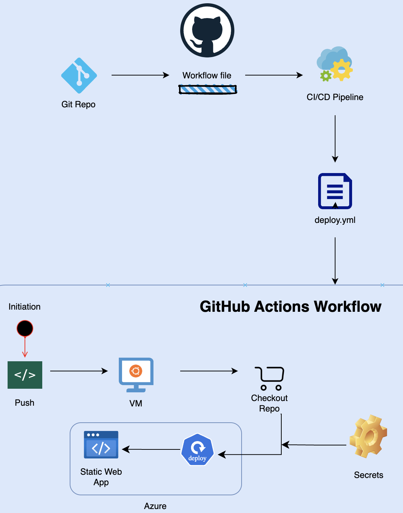
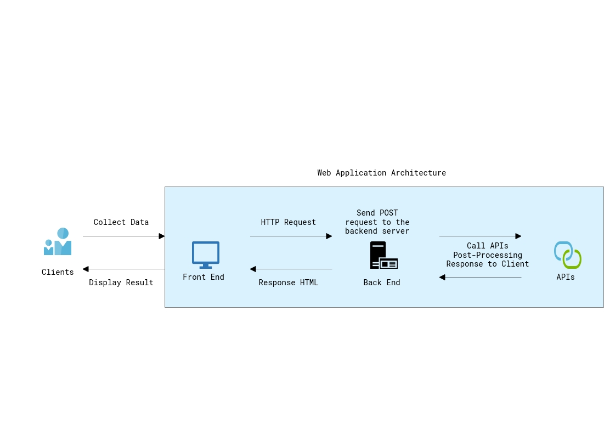
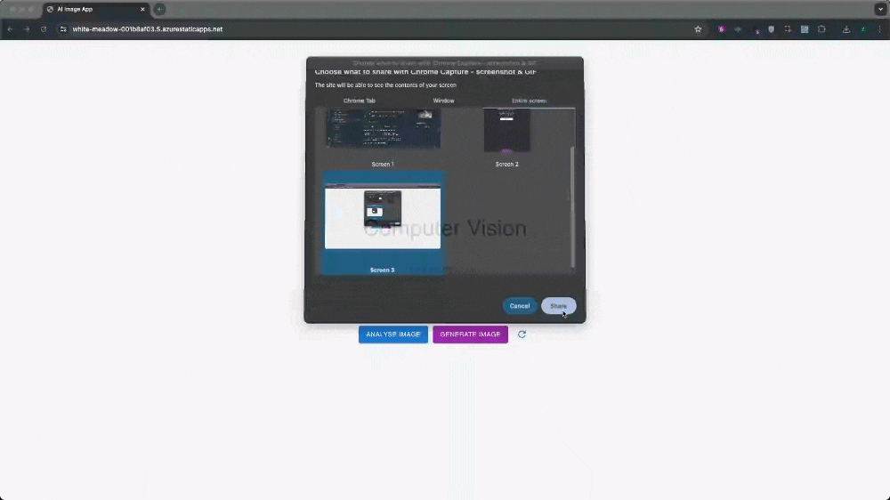

# Workflow Status

[](https://github.com/sohailsajid79/analyse-and-generate-images-with-Azure-AI/actions/workflows/deploy.yml)

# AI Image Web App

This project is in response to [Microsoft's challenge project](https://learn.microsoft.com/en-us/training/modules/challenge-project-add-image-analysis-generation-to-app/?WT.mc_id=academic-114319-gwynethp) - add image analysis and generation capabilities to your application.

## Table of Contents

- [Overview](#overview)
- [Features](#features)
- [Architecture](#architecture)
- [Getting Started](#getting-started)
- [Prerequisites](#prerequisites)
- [Installation](#installation)
- [Configuration](#configuration)
- [Usage](#usage)

## Overview

The UI allows users to analyse and generate images using Azure AI Vision & OpenAI API services. The application is built with React for the frontend and Node.js (Express.js) for the backend. It is deployed on Azure Static Web App with the CI/CD handled by GitHub Actions.



## Features

- Analyse .PNG images by providing an image URL and receiving a caption as output.
- Generate images by providing a text prompt for the Dall-E 3 model and receiving an image as output.
- Clear/reset UI from the frontend.
- Continuous Integration and Deployment with GitHub Actions.
- Hosted on Azure Static Web App.

## Architecture

    






1. **Simple User Interface (Frontend)**:

   - Built with React.
   - Hosted on Azure Static Web App.
   - Includes buttons for "ANALYSE IMAGE", "GENERATE IMAGE" & Refresh Icon.

2. **Frontend Deployment**:

   - GitHub Actions for CI/CD.
   - Build, test, and deploy steps configured in GitHub Actions.

3. **Backend Services**:

   - Built with Node.js (Express.js).
   - Hosted on Azure App Services.
   - server.js Endpoints:
     - `/analyze-image`: Analyses an image URL using Azure AI Vision service.
     - `/generate-image`: Generates an image based on a text prompt using OpenAI Dall-E 3 model.
     - `/clear-request`: Clear the user input data.

4. **API Calls**:
   - **ANALYSE IMAGE**: Calls Azure AI Vision service API to analyse the image and return a caption.
   - **GENERATE IMAGE**: Calls OpenAI Dall-E API to generate an image based on the provided prompt by the user.

## Getting Started

### Prerequisites

- Node.js and npm installed on your local machine.
- Azure account for hosting the application and using Azure AI Vision services.
- OpenAI API key and organization ID.

### Installation

1. Clone the repository:

   ```sh
   git clone https://github.com/sohailsajid79/analyse-and-generate-images-with-Azure-AI.git
   cd analyse-and-generate-images-with-Azure-AI
   ```

2. Install frontend dependencies:

   ```sh
   cd frontend
   npm install
   ```

3. Install backend dependencies:
   ```sh
   cd ../backend
   npm install
   ```

### Configuration

Create a .env file in the backend directory and add the following environment variables:

    VISION_ENDPOINT=your-azure-openai-endpoint
    VISION_KEY=your-azure-openai-key
    OPENAI_API_KEY=your-openai-api-key
    OPENAI_ORGANIZATION_ID=your-openai-organization-id
    PORT=5001

### Usage

1. Start the backend server:

   ```sh
   cd ../backend
   node server.js
   ```

2. Start the backend server:
   ```sh
   cd ../frontend
   npm start
   ```
3. Open your browser and navigate to http://localhost:3000 to use the application.
